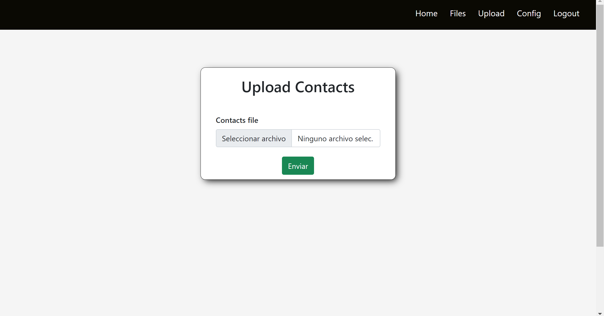

# Contact Importer
Web Client Aplication to save contact data from csv

## Technologies
* React
* React Router DOM
* Boostrap
* Web Pack

## Preview
### Home page

### File upload page

## Getting Started
Open your terminal clone the repository typing the next commando 

`git clone https://github.com/luisFelipeEvilla/contact-importer.git`

### Deployment

1. First you need to run the backend REST API service see [contact-importer-api](https://github.com/luisFelipeEvilla/contact-importer-api.git)
2. Open the project root directory on your terminal and type

`npm install`

`npm start`
